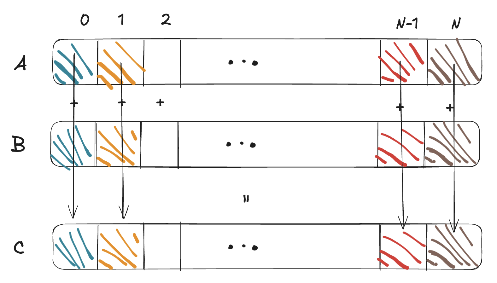

# Vector Addition

**Problem Definition:** Given two vectors of size `N`, `A` and `B`, we want to add them element-wise and store the result in a third vector `C`.

```cpp
float *h_A, *h_B, *h_C;
int N = 1 << 20;

h_A = (float*)malloc(N * sizeof(float));
h_B = (float*)malloc(N * sizeof(float));
h_C = (float*)malloc(N * sizeof(float));

for (int i = 0; i < N; i++) {
    h_A[i] = i;
    h_B[i] = i;
}

for (int i = 0; i < N; i++) {
    h_C[i] = h_A[i] + h_B[i];
}
```
Seems very straightforward, right? But now let's think about how we can make it parallel and utilize CUDA and Kernels.

## Parallel Thinking



In the CPU code above, the `for` loop executes sequentially. Iteration `i=0` happens, then `i=1`, and so on. However, notice that the addition `C[0] = A[0] + B[0]` is completely independent of `C[1] = A[1] + B[1]`.

This means we don't need to wait for one addition to finish before starting the next. If we had `N` workers, they could all do one addition at the exact same time.

In CUDA, we can assign each iteration of the loop to a single **Thread**.

## The Kernel

We need to define a function (Kernel) that a single thread will execute. Instead of a loop over `i`, the kernel will compute the index `i` that belongs to *this specific thread* and then perform the work for that index.

### 1. Calculate the Global Index
As we learned in the preliminaries, we use the built-in variables to find where a thread lives in the grid.

```cpp
int i = blockIdx.x * blockDim.x + threadIdx.x;
```

- `blockIdx.x`: "Which block am I in?"
- `blockDim.x`: "How many threads are in a block?"
- `threadIdx.x`: "Which thread am I within my block?"

### 2. Guard Against Out-of-Bounds
If our total number of threads is slightly larger than `N` (because blocks are a fixed size, e.g., 256), we need to make sure we don't access invalid memory.

```cpp
if (i < N) {
    C[i] = A[i] + B[i];
}
```

### 3. The Full Kernel Code
Putting it together with the `__global__` specifier:

```cpp
__global__ void vectorAdd(const float *A, const float *B, float *C, int N) {
    int i = blockIdx.x * blockDim.x + threadIdx.x;

    if (i < N) {
        C[i] = A[i] + B[i];
    }
}
```

Notice that `C` is passed as a pointer (`float *C`). Since Kernels are always `void` return type, we must pass a pointer to the memory where we want to write the results. This is effectively "pass by reference" semantics—we are giving the kernel the address of the output array so it can modify the data directly in the device memory.

## The Host Code

The CPU (Host) is responsible for setting everything up. Here is the standard recipe:

### 1. Monitor and Launch
The main function needs to prepare the data and send it to the GPU.

```cpp
// 1. Allocate Device Memory
float *d_A, *d_B, *d_C;
cudaMalloc((void**)&d_A, size);
cudaMalloc((void**)&d_B, size);
cudaMalloc((void**)&d_C, size);

// 2. Copy Data from Host to Device
cudaMemcpy(d_A, h_A, size, cudaMemcpyHostToDevice);
cudaMemcpy(d_B, h_B, size, cudaMemcpyHostToDevice);

// 3. Launch the Kernel
int threadsPerBlock = 256;
int blocksPerGrid = (N + threadsPerBlock - 1) / threadsPerBlock;

vectorAdd<<<blocksPerGrid, threadsPerBlock>>>(d_A, d_B, d_C, N);

// 4. Copy Result back to Host
cudaMemcpy(h_C, d_C, size, cudaMemcpyDeviceToHost);

// 5. Free Memory
cudaFree(d_A); cudaFree(d_B); cudaFree(d_C);
```

### Grid Sizing Calculation
Notice the calculation for `blocksPerGrid`:
`int blocksPerGrid = (N + threadsPerBlock - 1) / threadsPerBlock;`

This is a common ceiling division formula. It ensures that even if `N` is not a perfect multiple of `threadsPerBlock`, we have enough blocks to cover all `N` elements. We will do this a lot so get used to it!

## Putting it all together

Here is what the final `vector_add.cu` will kind of look like:

```cpp
#include <stdio.h>
#include <cuda_runtime.h>

__global__ void vectorAdd(const float *A, const float *B, float *C, int N) {
    int i = blockDim.x * blockIdx.x + threadIdx.x;
    if (i < N) {
        C[i] = A[i] + B[i];
    }
}

int main() {
    int N = 1 << 20; // 1M elements
    size_t size = N * sizeof(float);

    // Allocate Host memory
    float *h_A = (float *)malloc(size);
    float *h_B = (float *)malloc(size);
    float *h_C = (float *)malloc(size);

    // Initialize inputs
    for (int i = 0; i < N; ++i) {
        h_A[i] = i;
        h_B[i] = i;
    }

    // Allocate Device memory
    float *d_A, *d_B, *d_C;
    cudaMalloc(&d_A, size);
    cudaMalloc(&d_B, size);
    cudaMalloc(&d_C, size);

    // Copy Host -> Device
    cudaMemcpy(d_A, h_A, size, cudaMemcpyHostToDevice);
    cudaMemcpy(d_B, h_B, size, cudaMemcpyHostToDevice);

    // Launch Kernel
    int threadsPerBlock = 256;
    int blocksPerGrid = (N + threadsPerBlock - 1) / threadsPerBlock;
    vectorAdd<<<blocksPerGrid, threadsPerBlock>>>(d_A, d_B, d_C, N);

    // Copy Device -> Host
    cudaMemcpy(h_C, d_C, size, cudaMemcpyDeviceToHost);
    
    // Verify (check first 5 elements)
    for(int i=0; i<5; i++) {
        printf("%f + %f = %f\n", h_A[i], h_B[i], h_C[i]);
    }

    // Free memory on device
    cudaFree(d_A);
    cudaFree(d_B);
    cudaFree(d_C);

    // Free memory on host
    free(h_A);
    free(h_B);
    free(h_C);

    return 0;
}
```
