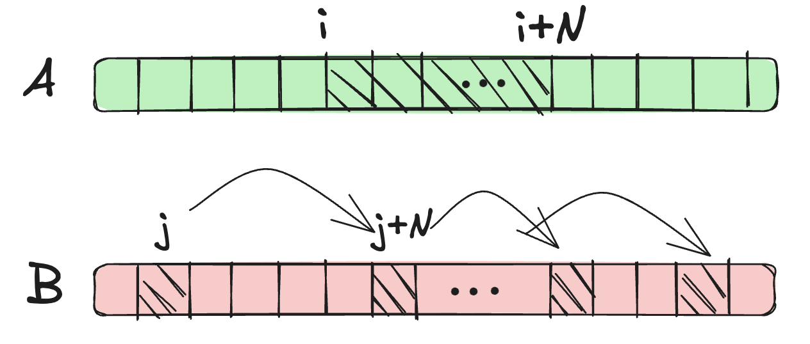
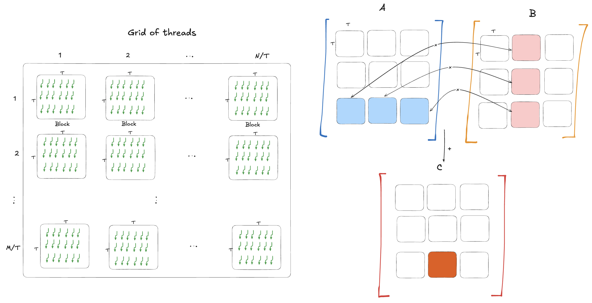

# Matrix Multiplication

## Problem Definition
Given two matrices of size $M \times N$, $A$ and $B$, we want to multiply them and store the result in a third matrix $C$.

Here is the simple CPU code that calculates each element of matrix $C_{ij}$ by summing the product of the corresponding row $A_i$ and column $B_j$ in $O(M \times N^2)$ time complexity.

```cpp
    float *h_A, *h_B, *h_C;
    int M = 1 << 20;
    int N = 1 << 20;

    h_A = (float*)malloc(M * N * sizeof(float));
    h_B = (float*)malloc(M * N * sizeof(float));
    h_C = (float*)malloc(M * N * sizeof(float));

    for (int i = 0; i < M; i++) {
        for (int j = 0; j < N; j++) {
            h_A[i * N + j] = i;
            h_B[i * N + j] = j;
        }
    }

    for (int i = 0; i < M; i++) {
        for (int j = 0; j < N; j++) {
            h_C[i * N + j] = 0;
            for (int k = 0; k < N; k++) {
                h_C[i * N + j] += h_A[i * N + k] * h_B[k * N + j];
            }
        }
    }
```

Notice instead of allocating a 2D array, we allocated a 1D array and access it as a 2D array with smart indexing as formula $i \times N + j$.

## Parallel Thinking


**Core idea**: Each two distinct elements of $C$, $C_{ij}$ and $C_{rk}$, given two inputs $A$ and $B$, are independent of each other and can be computed in parallel. That's what we can assign to each thread to compute. Now think about how we're supposed to launch the kernel.

Since kernels can be launched up to 3 dimensions, we can use 2 dimensions to cover all elements of $C$, $M \times N$.

```cpp
  int threadsPerBlock = 256;
  int blocksPerGridX = (M + threadsPerBlock - 1) / threadsPerBlock;
  int blocksPerGridY = (N + threadsPerBlock - 1) / threadsPerBlock;

  matMul<<<blocksPerGridX, blocksPerGridY>>>(d_A, d_B, d_C, M, N);
```

And then we can calculate the global index of each thread as follows:

```cpp
int i = blockIdx.x * blockDim.x + threadIdx.x;
int j = blockIdx.y * blockDim.y + threadIdx.y;
```

### Kernel Code

```cpp
__global__ void matMul(const float *A, const float *B, float *C, int M, int N) {
    int i = blockIdx.x * blockDim.x + threadIdx.x;
    int j = blockIdx.y * blockDim.y + threadIdx.y;

    if (i < M && j < N) {
        float sum = 0;
        for (int k = 0; k < N; k++) {
            sum += A[i * N + k] * B[k * N + j];
        }
        C[i * N + j] = sum;
    }
}
```

Amazing! We've just implemented a matrix multiplication kernel. Unfortunatelly, this implementation is called naive :( and it's not optimal. The problem is in the way we access the memory. It's a good time to introduce memory access patterns, memory hierarchy, and synchronization.

## Memory Access Patterns

**coalesced access**: Accessing consecutive memory locations in a single transaction.

**strided access**: Accessing non-consecutive memory locations in multiple transactions with a fixed skip.

**random access**: Accessing memory locations in an arbitrary order (e.g., linked list, hash tables).

We prefer coalesced access as it enables the hardware to coalesce groups of reads or writes of multiple data items into one operation. Data that cannot be laid out so as to enable coalescing, or that doesn’t have enough locality to use the caches effectively, will tend to see lesser speedups when used in computations on GPUs.



As we can see, the way we read from $A$ is coalesced but for $B$ it's strided for each thread. This is not optimal as it slows down the memory access! We can improve it by using a special memory called **shared memory**. First, let's learn about the memory hierarchy on GPUs.

## Memory Hierarchy
CUDA exposes several types of memory with different scopes and speeds:

1.  **Registers**: Fastest memory. Private to each thread. For example, the sum variable in the kernel is stored in a register.
2.  **Local Memory**: Slower, part of global memory but private to a thread (used for spills).
3.  **Shared Memory**: Fast, on-chip memory. Shared by threads within the same **Block**. Used for efficient inter-thread communication.
4.  **Constant Memory**: Read-only cache, fast if all threads read the same address.
5.  **Global Memory**: Largest but slowest (off-chip). Global memory is the primary memory space for storing data that is accessible by all threads in a kernel. It is similar to RAM in a CPU system. Global memory is allocated with CUDA API calls such as `cudaMalloc`. Data can be copied into global memory from CPU memory using CUDA runtime API calls such as `cudaMemcpy` and freed with `cudaFree`.

## Tiled Matrix Multiplication

If we could access $B$ the same way as we access $A$ in coalesced way, the problem is solved. However, the nature of matrix multiplication requires us to traverse $B$ column-wise, which inherently leads to strided access patterns.

To solve this, we can take advantage of the fact that threads in the same block are interested in data that is located nearby in the matrix. Instead of each thread fetching its own data from the slow Global Memory independently, they can work together using **tiling**.

### The Core Idea: Tiling

The idea is to partition the large matrices into smaller sub-matrices called **Tiles** that fit into the fast **Shared Memory**.

We divide the output matrix $C$ into square tiles of size `TILE_SIZE` $\times$ `TILE_SIZE`. Each CUDA block is assigned to compute one such tile of $C$.



To compute its tile of $C$, the block moves step-by-step across the matrices $A$ and $B$. In each step (or phase):
1.  **Cooperative Loading**: All threads in the block work together to load a square tile from matrix $A$ and a square tile from matrix $B$ into Shared Memory. Each thread typically loads just one element for $A$ and one for $B$.
2.  **Synchronization**: We must ensure that *all* threads have finished loading their data before any thread begins reading it. This is done using `__syncthreads()`.
3.  **Compute**: Threads perform the matrix multiplication on the small tiles currently stored in Shared Memory.
4.  **Synchronization**: We must wait for *all* threads to finish computing before we overwrite the Shared Memory with the next tiles.

This process repeats until the block has swept through the entire width of $A$ (and height of $B$).

### Mapping to Hardware

Let's look at how this maps to our CUDA code in `tiled_mat_mul.cu`.

**1. Grid and Block Dimensions**

We define the tile size to match our block dimensions. A common choice is $32 \times 32$, allowing us to use 1024 threads per block.

```cpp
#define TILE_SIZE 32

// Each block handles a 32x32 tile of C
dim3 threadsPerBlock(TILE_SIZE, TILE_SIZE);

// The grid covers the full NxM matrix
dim3 blocksPerGrid((N + TILE_SIZE - 1) / TILE_SIZE,
                   (M + TILE_SIZE - 1) / TILE_SIZE);
```

**2. The Logic: Computing Interleaves with Loading**

Inside the kernel, each thread identifies its local position (`tx`, `ty`) within the tile and its global position (`row`, `col`) in the matrix.

```cpp
// Iterate over tiles with index t
for (int t = 0; t < (N + TILE_SIZE - 1) / TILE_SIZE; ++t) {

    // 1. LOAD: Each thread loads one element from A and B into Shared Memory
    // Note: We check boundaries to handle matrices that aren't multiples of TILE_SIZE
    if (row < M && (t * TILE_SIZE + tx) < N)
         As[ty][tx] = A[row * N + t * TILE_SIZE + tx];
    else
         As[ty][tx] = 0.0f;

    if ((t * TILE_SIZE + ty) < N && col < N)
         Bs[ty][tx] = B[(t * TILE_SIZE + ty) * N + col];
    else
         Bs[ty][tx] = 0.0f;

    // 2. SYNC: Ensure shared memory is populated
    __syncthreads();

    // 3. COMPUTE: Multiply the two tiles together
    for (int k = 0; k < TILE_SIZE; ++k) {
        acc += As[ty][k] * Bs[k][tx];
    }

    // 4. SYNC: Ensure we are done with these tiles before next iteration loads new ones
    __syncthreads();
}
```

By using tiling, we drastically reduce the bandwidth pressure on Global Memory. Instead of reading data from Global Memory $N$ times (once for every operation), we read it once into Shared Memory and reuse it `TILE_SIZE` times. This is the key to achieving high performance on GPUs!