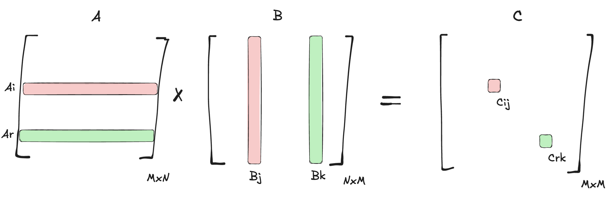

# Matrix Multiplication

## Problem Definition
Given two matrices of size $M \times N$, $A$ and $B$, we want to multiply them and store the result in a third matrix $C$.

Here is the simple CPU code that calculates each element of matrix $C_{ij}$ by summing the product of the corresponding row $A_i$ and column $B_j$ in $O(M \times N^2)$ time complexity.

```cpp
    float *h_A, *h_B, *h_C;
    int M = 1 << 20;
    int N = 1 << 20;

    h_A = (float*)malloc(M * N * sizeof(float));
    h_B = (float*)malloc(M * N * sizeof(float));
    h_C = (float*)malloc(M * N * sizeof(float));

    for (int i = 0; i < M; i++) {
        for (int j = 0; j < N; j++) {
            h_A[i * N + j] = i;
            h_B[i * N + j] = j;
        }
    }

    for (int i = 0; i < M; i++) {
        for (int j = 0; j < N; j++) {
            h_C[i * N + j] = 0;
            for (int k = 0; k < N; k++) {
                h_C[i * N + j] += h_A[i * N + k] * h_B[k * N + j];
            }
        }
    }
```

Notice instead of allocating a 2D array, we can allocate a 1D array and access it as a 2D array with smart indexing as formula $i \times N + j$.

## Parallel Thinking



**Core idea**: Each two distinct elements of $C$, $C_{ij}$ and $C_{rk}$, given two inputs $A$ and $B$, are independent of each other and can be computed in parallel. That's what we can assign to each thread to compute. Now think about how we're supposed to launch the kernel.

Since kernels can be launched up to 3 dimensions, we can use 2 dimensions to cover all elements of $C$, $M \times N$.

```cpp
  int threadsPerBlock = 256;
  int blocksPerGridX = (M + threadsPerBlock - 1) / threadsPerBlock;
  int blocksPerGridY = (N + threadsPerBlock - 1) / threadsPerBlock;

  matMul<<<blocksPerGridX, blocksPerGridY>>>(d_A, d_B, d_C, M, N);
```

And then we can calculate the global index of each thread as follows:

```cpp
int i = blockIdx.x * blockDim.x + threadIdx.x;
int j = blockIdx.y * blockDim.y + threadIdx.y;
```

### Kernel Code

```cpp
__global__ void matMul(const float *A, const float *B, float *C, int M, int N) {
    int i = blockIdx.x * blockDim.x + threadIdx.x;
    int j = blockIdx.y * blockDim.y + threadIdx.y;

    if (i < M && j < N) {
        float sum = 0;
        for (int k = 0; k < N; k++) {
            sum += A[i * N + k] * B[k * N + j];
        }
        C[i * N + j] = sum;
    }
}
```

Amazing! We've just implemented a matrix multiplication kernel. Unfortunatelly, this implementation is called naive :( and it's not optimal. The problem is in the way we access the memory. It's a good time to introduce memory access patterns, memory hierarchy, and synchronization.

## Memory Access Patterns

**coalesced access**: Accessing consecutive memory locations in a single transaction.

**strided access**: Accessing non-consecutive memory locations in multiple transactions.

## Memory Hierarchy
CUDA exposes several types of memory with different scopes and speeds:

1.  **Registers**: Fastest memory. Private to each thread.
2.  **Local Memory**: Slower, part of global memory but private to a thread (used for spills).
3.  **Shared Memory**: Fast, on-chip memory. Shared by threads within the same **Block**. Used for efficient inter-thread communication.
4.  **Global Memory**: Largest but slowest (off-chip). Accessible by all threads and the Host.
5.  **Constant Memory**: Read-only cache, fast if all threads read the same address.

## Synchronization
Since threads run in parallel, we often need to coordinate them.

- **`__syncthreads()`**: Barrier synchronization for threads within the **same Block**. All threads in the block must reach this point before any can proceed.
- **`cudaDeviceSynchronize()`**: Called from the Host. Blocks the CPU until all preceding GPU tasks (kernels, copies) are complete.

